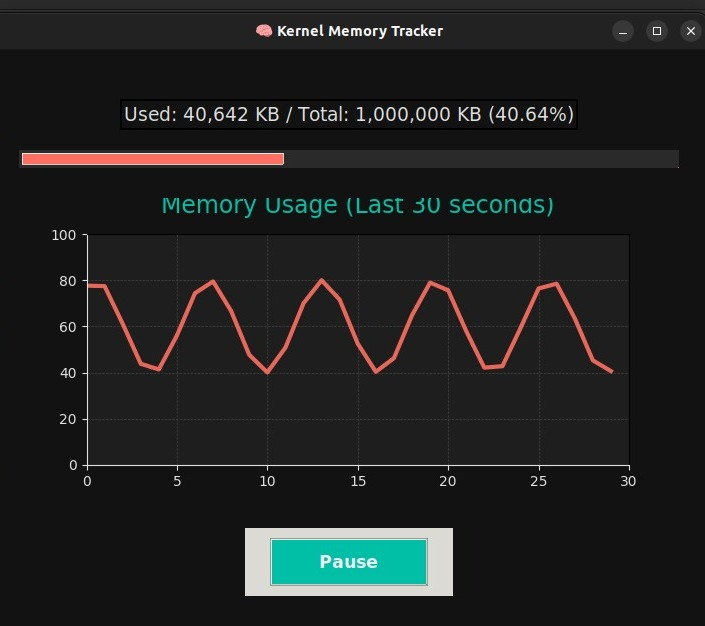
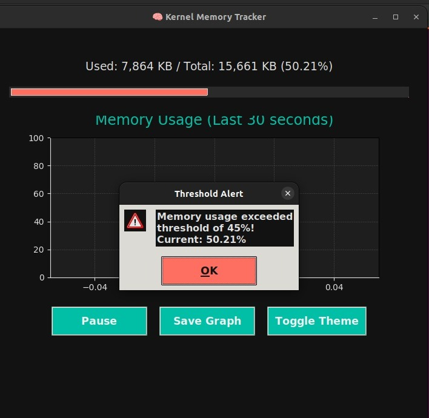
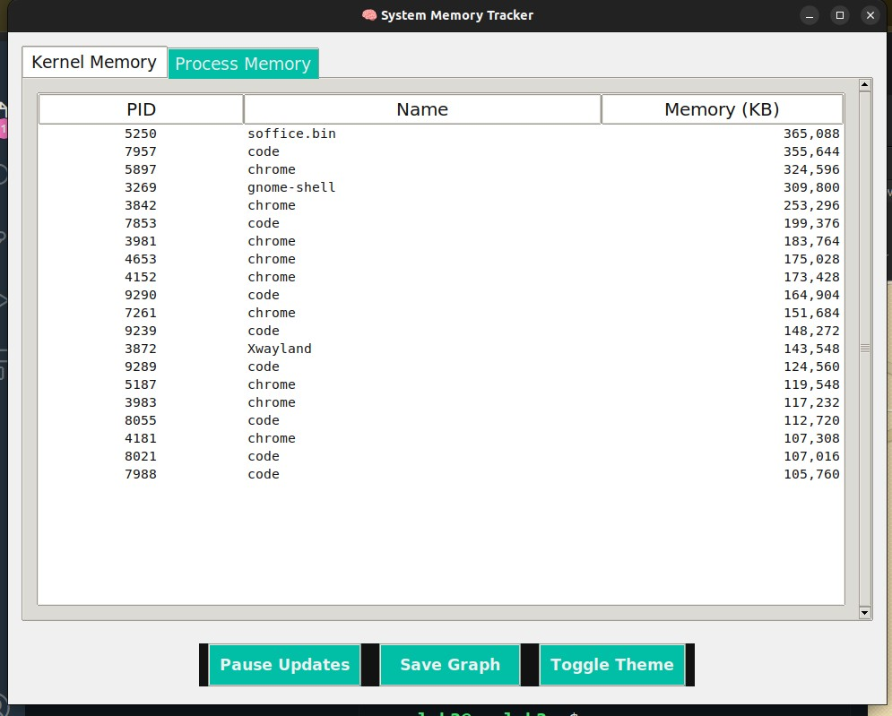

# Kernel Memory Tracker

🧠 A Loadable Kernel Module (LKM) to monitor Linux kernel memory usage, with a Python Tkinter GUI to visualize system and process memory in real-time.

---

## Overview

This project includes:

- A **Kernel Module** (`mem_tracker.ko`) that tracks kernel memory usage and exposes it via `/proc/mem_tracker`.
- A **Python GUI** using Tkinter and Matplotlib that reads kernel and process memory info to display live graphs, tables, and alerts.

---

## Features

- Real-time kernel memory usage monitoring
- Process memory listing with top consumers
- Progress bar and live graph plotting of memory usage trends
- Dark/light theme toggle
- Pause/resume live updates
- Save graphs as PNG files
- Alerts on memory usage thresholds
- Runs on Linux (Ubuntu or compatible)

---

## Installation

### Kernel Module

```bash
make
sudo insmod mem_tracker.ko
cat /proc/mem_tracker  # Verify output
python ui.py
```
## Usage

- Monitor kernel memory in real-time with graph and progress bar.
- View top memory-consuming processes.
- Pause/resume data updates.
- Toggle dark/light UI theme.
- Save current memory usage graph as an image.
- Receive alerts when usage crosses threshold.

 ## Output Snapshots
 
 
 
